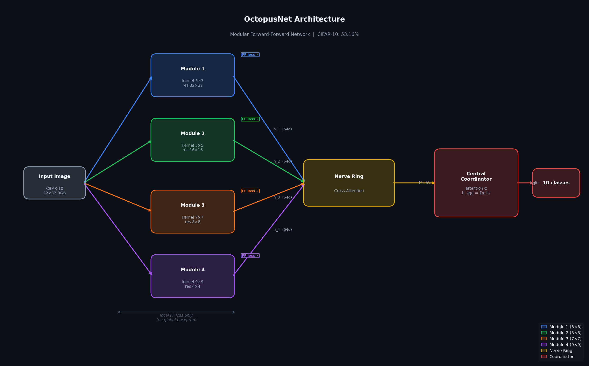

# 🐙 OctopusNet

OctopusNet is a modular neural network that learns without global backpropagation. Four independent modules process the same image at different resolutions, each trained locally with Hinton's Forward-Forward algorithm, and a central coordinator aggregates their outputs via attention. The result: **68.65% on CIFAR-10 with zero global gradients between modules — and a resilience floor of 67.03% when any single module fails**.

The design is inspired by the octopus nervous system, where ~2/3 of neurons live in the arms and compute locally before sending signals to the brain. Each module here is an arm.

> Undergraduate thesis: Erick, 2026.

## Why OctopusNet?

Centralized networks are fragile. When any component fails, the system collapses.

| Model | Normal accuracy | Single module fails | Two modules fail | Degradation |
|-------|----------------|--------------------|-----------------|-------------|
| CNN (backprop) | **90.96%** | 10.00% (random chance) | — | −80.96 pts |
| OctopusNet (FF) | 52.50% | 41.72% | ~30% | −10.78 pts |
| OctopusNet + Channel Grouping (A18b) | 64.17% | 41.47% | 22.32% | −22.70 pts |
| OctopusNet + CG + Module Dropout (A6b) | 64.34% | 61.12% | 52.87% | −3.22 pts |
| OctopusNet + Stride Conv + ModDrop p=0.5 (A21) | 69.22% | 66.28% | 47.69% | −2.94 pts |
| OctopusNet + Stride Conv + ModDrop p=0.7 (A21b) | **68.65%** | **67.03%** | **56.03%** | **−1.62 pts** |

FF standard had one catastrophic failure point — losing M1 dropped accuracy to 13.89%, near random chance. Channel grouping eliminates that. Stride conv + Module Dropout p=0.7 (A21b) goes further: every single-module failure stays above 67%, every double-module failure stays above 56%. The floor is structural, not lucky.

A21b improves A6b on all three metrics simultaneously: +4.31% accuracy, +5.91pts single-failure floor, +3.16pts double-failure floor. No tradeoff.

This matters for robotics, IoT, autonomous vehicles, and embedded systems where a sensor can fail at any time.

---

## What is this?

OctopusNet is a neural network that learns without global backprop. Instead of one big network trained end-to-end, it uses **N independent processing modules** (any differentiable architecture) that each learn locally using Hinton's Forward-Forward algorithm. A central coordinator aggregates their outputs via attention. Current implementation uses CNNs with heterogeneous kernel sizes.

Inspired loosely by the octopus nervous system, where ~2/3 of neurons live in the arms and process information locally before sending signals to the brain.

Key features: **multiscale input** (each module sees a different resolution), **Fourier label overlay** (labels encoded as frequency patterns instead of pixel patches), and two training modes: standard backprop coordinator or fully local SFF.

---

## Architecture



Each module learns to distinguish **positive samples** (image + correct label overlay) from **negative samples** (image + wrong label) using a local goodness score. No gradients flow between modules.

---

## Results (CIFAR-10)

| Mode | Accuracy | Epochs | Notes |
|------|----------|--------|-------|
| FF modules + backprop coordinator | 52.75% | 100 | Standard mode |
| FF modules + SFF local coordinator | 53.16% | 100 | 100% local learning |
| Simple ensemble average (SFF) | 53.59% | 100 | Best fully local result |
| Channel Grouping + coordinator (A18b) | 64.17% | 30 | Floor 41.47% |
| Channel Grouping + Module Dropout p=0.5 (A6b) | 64.34% | 30 | Floor 61.12% |
| CG + Stride Conv + ModDrop p=0.5 (A21) | 69.22% | 30 | Floor single 66.28%, floor doble 47.69% |
| CG + Stride Conv + ModDrop p=0.7 (A21b) | **68.65%** | 30 | **Best overall** — floor single 67.03%, floor doble 56.03% |

### Module specialization (A15b)

Each module specializes in different classes:

| | airplane | auto | bird | cat | deer | dog | frog | horse | ship | truck |
|---|---|---|---|---|---|---|---|---|---|---|
| M1 | 54% | 48% | 47% | 37% | 52% | **58%** | **60%** | 55% | 51% | 44% |
| M2 | 52% | **65%** | 46% | 38% | 54% | 51% | 54% | 55% | **64%** | 56% |
| M3 | 53% | 55% | **50%** | **41%** | **57%** | 55% | **61%** | **58%** | 55% | 50% |
| M4 | 53% | 58% | 47% | 39% | 53% | 53% | 57% | 55% | 60% | **62%** |

### GWT Competition (A10)

| Mechanism | Accuracy | Tradeoff |
|-----------|----------|----------|
| Soft attention | **43.72%** | Best for N=4 modules |
| Top-K (K=2) | 42.32% | Good for N>>4 |
| Gumbel-softmax | 39.33% | Hard selection, needs more modules |
| Top-K (K=1) | 38.09% | Too sparse for small N |

---

## Training Modes

### A21b mode: best overall (recommended)
```bash
python train.py --channel_grouping --module_dropout 0.7 --stride_compress --epochs 30
```
68.65% accuracy, single-failure floor 67.03%, double-failure floor 56.03%. Stride conv compression + Module Dropout p=0.7.

### A6b mode: best accuracy/resilience balance (no stride conv)
```bash
python train.py --channel_grouping --module_dropout 0.5 --epochs 30
```
64.34% accuracy, single-failure floor 61.12%.

### Standard mode (FF + backprop coordinator)
```bash
python train.py --dataset cifar10 --epochs 50
```

### SFF mode: 100% local learning
```bash
python train.py --use_sff --dataset cifar10 --epochs 50
```

In SFF mode, an `AuxClassifier` attaches to each module's feature map and a `LogitCoordinator` learns attention over their logits. No global backprop anywhere.

### Options
```
--dataset              cifar10 | cifar100 | mnist  (default: cifar10)
--epochs               int                          (default: 30)
--batch_size           int                          (default: 128)
--bottleneck           int                          (default: 64)
--use_sff              flag                         100% local SFF mode
--no_channel_grouping  flag                         disable CGCNNModule (on by default)
--no_stride_compress   flag                         disable stride conv, use pool (A6b mode)
--module_dropout       float                        module dropout prob (default: 0.7 = A21b)
--no_multiscale        flag                         disable multiscale input
--seed                 int                          (default: 42)
--device               cuda | cpu                   (auto-detected)
```

---

## Quick Start

```python
from config import OctopusNetConfig
from octopusnet import OctopusNet
from train import train

config = OctopusNetConfig(
    dataset="cifar10",
    epochs=50,
    device="cuda"
)

model, history = train(config)           # standard mode
model, history = train(config, use_sff=True)  # 100% local
```

---

## Google Colab

Upload `OctopusNet_Colab.ipynb` to Colab and run cells. Includes all experiments, visualizations, and ablations.

---

## File Structure

| File | Description |
|------|-------------|
| `config.py` | Model hyperparameters |
| `modules.py` | CNN modules + ModuleDecoder |
| `nerve_ring.py` | Cross-attention lateral communication |
| `coordinator.py` | Coordinator + AuxClassifier + LogitCoordinator |
| `octopusnet.py` | Full model |
| `data.py` | Dataset loaders |
| `train.py` | Training loop (standard + SFF) |
| `experiments.py` | Ablation experiments |
| `OctopusNet_Colab.ipynb` | Interactive notebook |

---

## Ablations

| ID | What | Key Finding |
|----|------|-------------|
| A1 | Number of modules (2, 4, 8, 16) | 4 modules optimal |
| A2 | Bottleneck size (8–128) | 64 best accuracy/size tradeoff |
| A6 | Module resilience (FF) | Floor 41.72%, one catastrophic point at 13.89% |
| A7 | With/without feedback | Feedback adds ~0.5% |
| A8 | With/without nerve ring | Nerve ring adds ~1% |
| A9 | Homogeneous vs heterogeneous | Heterogeneous kernels help |
| A10 | GWT competition mechanism | Soft attention wins for N=4 |
| A15b | SFF local coordinator | 53.16%: best fully local mode |
| A18b | Channel grouping (Ortiz Torres) | 64.17%: eliminates catastrophic failures, floor 41.47% |
| A6b | Channel grouping + Module Dropout | 64.34%: floor jumps to 61.12% — +19.65 pts vs A18b, no accuracy cost |
| A17 | Iterative nerve ring (N rounds) | Rounds=1 optimal — more rounds homogenize representations, hurt accuracy |
| A19 | CGCNNModule + ResBlocks | 63.24%: FF doesn't scale in depth — pool destroys what ResBlocks build |
| A20 | Pool 4×4 → 6×6 | 61.49%: larger pool is worse — spatial pooling was not the bottleneck |
| A21 | Pool → stride conv (learned compression) | 69.22%: +4.88pts over A6b, but floor doble 47.69% (M1+M2 co-specialized) |
| A21b | Stride conv + Module Dropout p=0.7 | **68.65%: best overall** — floor single 67.03%, floor doble 56.03%, no catastrophic pairs |
| A22 | goodness pre-pool vs post-pool | 62.96%: goodness location doesn't matter — not the bottleneck |

---

## References

**Forward-Forward**
- Hinton, G. (2022). [The Forward-Forward Algorithm: Some Preliminary Investigations](https://arxiv.org/abs/2212.13345)
- Krotov & Hopfield (2023). Training CNNs with the Forward-Forward Algorithm. [arXiv:2312.14924](https://arxiv.org/abs/2312.14924)
- Krutsylo (2025). Scalable Forward-Forward (SFF). [arXiv:2501.03176](https://arxiv.org/abs/2501.03176): basis for SFF local mode
- Ortiz Torres et al. (2025). On Advancements of the Forward-Forward Algorithm. [arXiv:2504.21662](https://arxiv.org/abs/2504.21662): 84.7% CIFAR-10, channel grouping technique
- ASGE (2025). Adaptive Spatial Goodness Encoding. [arXiv:2509.12394](https://arxiv.org/abs/2509.12394)
- SCFF (2025). Self-Contrastive Forward-Forward. Nature Communications: 98.70% MNIST, 80.75% CIFAR-10
- Codellaro et al. (2025). Training CNNs with Forward-Forward: Fourier spatial label encoding. Scientific Reports: basis for Fourier label overlay

**Global Workspace & Coordination**
- Goyal et al. (ICLR 2022). [Coordination Among Neural Modules Through a Shared Global Workspace](https://arxiv.org/abs/2103.01197)
- Baars, B. (1988). A Cognitive Theory of Consciousness: original GWT theory

**Octopus Neuroscience**
- Sumbre, G. et al.: Autonomous arm movements in octopus
- Gutnick, T. et al.: Information flow between brain and arms in octopus
- Hochner, B. (2012). An Embodied View of Octopus Neurobiology. Current Biology

---

## Cite

If you use OctopusNet in your research:

```bibtex
@misc{octopusnet2026,
  author    = {Arriola Aguill\'{o}n, Erick},
  title     = {OctopusNet: Bio-inspired Distributed Neural Architecture},
  year      = {2026},
  publisher = {GitHub},
  url       = {https://github.com/ErickUser1/OctopusNet}
}
```

---

## License

MIT
